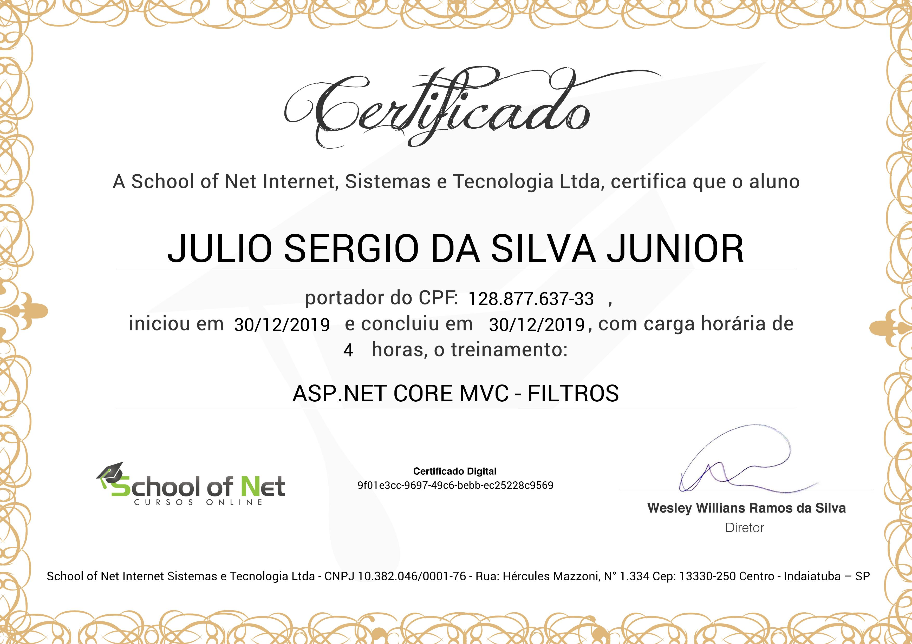

# ASP.NET Core MVC - Filtros
## [School of Net](https://www.schoolofnet.com)

* ASP.NET Core MVC

Instrutor: Anybal Rocha

"Neste curso serão apresentadas os vários tipos de filtros que podem ser aplicados em uma solução, como Authorization Filters, Resource Filters, Action Filters, Exception Filters e Result Filters. Estes podem ser trabalhados de forma a oferecer maior controle dos dados processados na sua aplicação, onde estes filtros podem ser executados antes ou depois de um determinados estágios do seu request."

